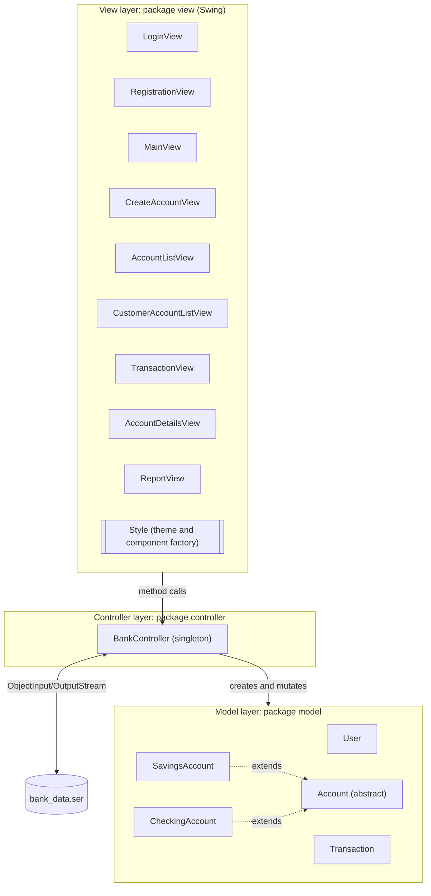
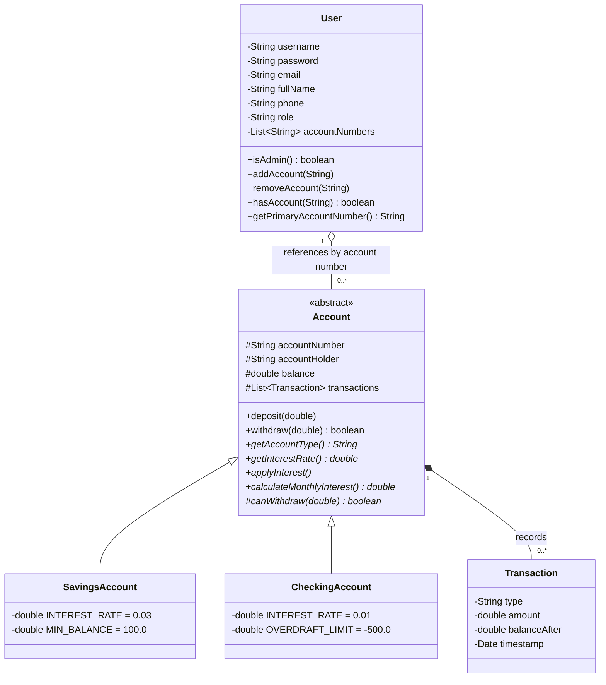
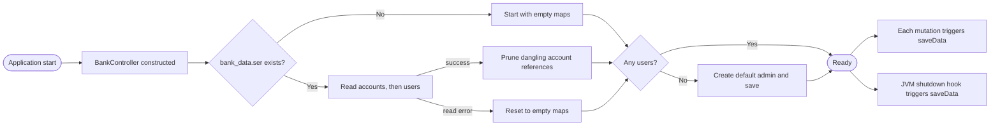
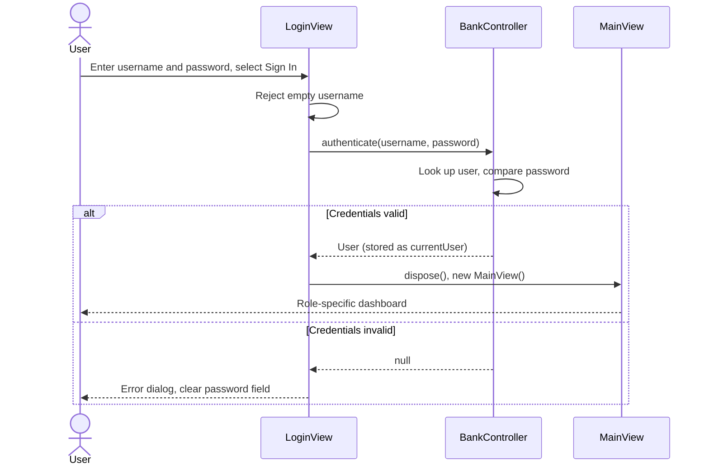
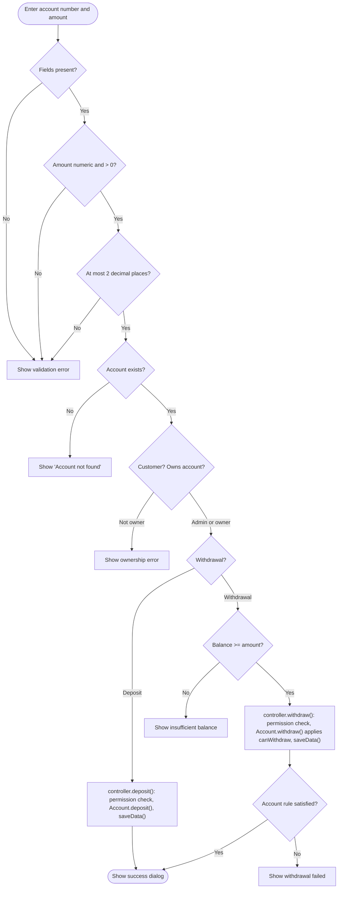

# Architecture

This document describes the design of SecureBank: its structure, components, data model, persistence mechanism, and principal workflows.

## Contents

1. [Overview](#1-overview)
2. [Architectural Style](#2-architectural-style)
3. [Component Reference](#3-component-reference)
4. [Domain Model](#4-domain-model)
5. [Persistence](#5-persistence)
6. [Key Workflows](#6-key-workflows)
7. [Cross-Cutting Concerns](#7-cross-cutting-concerns)
8. [Design Observations](#8-design-observations)

---

## 1. Overview

SecureBank is a single-process, single-user-at-a-time desktop application. All logic runs inside one Java Virtual Machine, and all state is held in memory and mirrored to a local file. There is no server, database, or network component.

| Attribute            | Value                                                        |
| -------------------- | ------------------------------------------------------------ |
| Pattern              | Model–View–Controller                                        |
| UI toolkit           | Java Swing (`javax.swing`, `java.awt`)                       |
| Entry point          | `main.BankingSystemApp`                                      |
| Module               | `BankingSystem` (requires `java.desktop`, `java.sql`)        |
| State holder         | `controller.BankController` (singleton)                      |
| Persistence          | Java serialization to `bank_data.ser`                        |
| Source files         | 18 Java files: 17 classes in four packages, plus the module descriptor |

## 2. Architectural Style

**Responsibilities by layer**

| Layer      | Package      | Responsibility                                                                                     |
| ---------- | ------------ | -------------------------------------------------------------------------------------------------- |
| View       | `view`       | Render windows, collect input, perform first-line input validation, and display results.           |
| Controller | `controller` | Authenticate users, enforce authorization, create and look up accounts, execute transactions, and persist state. |
| Model      | `model`      | Represent users, accounts, and transactions, and encapsulate account-type-specific rules.          |
| Entry      | `main`       | Configure the system look and feel and show the login window on the Event Dispatch Thread.         |

## 3. Component Reference

### 3.1 Entry point: `main.BankingSystemApp`

Sets the system look and feel, then schedules `new LoginView().setVisible(true)` with `SwingUtilities.invokeLater`.

### 3.2 Controller: `controller.BankController`

A lazily created singleton obtained with `BankController.getInstance()`. It holds:

| Field         | Type                   | Purpose                                           |
| ------------- | ---------------------- | ------------------------------------------------- |
| `accounts`    | `Map<String, Account>` | All accounts, keyed by account number             |
| `users`       | `Map<String, User>`    | All users, keyed by username                      |
| `currentUser` | `User`                 | The authenticated session user, or `null`         |
| `DATA_FILE`   | `String`               | Persistence file name (`bank_data.ser`)           |

On construction the controller registers a JVM shutdown hook that saves data, loads any existing data file, and creates the default administrator if there are no users.

**Public operations**

| Group          | Methods                                                                                              |
| -------------- | ---------------------------------------------------------------------------------------------------- |
| Session        | `authenticate`, `getCurrentUser`, `logout`                                                           |
| Registration   | `registerCustomer`, `usernameExists`, `emailExists`                                                  |
| Accounts       | `createAccount`, `getAccount`, `getAllAccounts`, `getCustomerAccounts`                               |
| Transactions   | `deposit`, `withdraw`, `applyInterestToAll`                                                          |
| Aggregates     | `getTotalSystemBalance`, `getTotalBalanceForCurrentUser`, `getAccountCountForCurrentUser`, `getTransactionCountForCurrentUser` |

### 3.3 Model: `model`

See [Domain Model](#4-domain-model).

### 3.4 Views: `view`

| Class                     | Role                                                                                         |
| ------------------------- | -------------------------------------------------------------------------------------------- |
| `LoginView`               | Split-screen sign-in window with branding panel and demonstration-credentials card           |
| `RegistrationView`        | Customer registration form with field-level validation                                       |
| `MainView`                | Role-aware dashboard: summary cards and action grid; refreshed by disposing and recreating   |
| `CreateAccountView`       | Account creation form (used by administrators and customers)                                 |
| `AccountListView`         | Table of all accounts (administrator)                                                        |
| `CustomerAccountListView` | Table of the current customer's accounts                                                     |
| `TransactionView`         | Shared deposit and withdrawal form, parameterized by transaction type                        |
| `AccountDetailsView`      | Account summary, transaction table, and statement export and print                           |
| `ReportView`              | System report with export and print (administrator)                                          |
| `Style`                   | Central palette, typography, and factory methods for buttons, fields, cards, and labels      |

Views obtain the controller through `BankController.getInstance()` and never modify model objects directly, with one caveat noted in [Design Observations](#8-design-observations): some authorization checks are duplicated in the view layer.

## 4. Domain Model

The original, more detailed UML class diagram, including the controller and views, is available as [`ClassDiagram.png`](../diagrams/UML/ClassDiagram.png).

**Notes on the model**

- `Account` is abstract; subclasses supply the interest rate, the withdrawal predicate `canWithdraw`, and interest calculations. Deposit and withdrawal mechanics and transaction recording live in the base class.
- Every account starts with an `INITIAL_DEPOSIT` transaction, including zero-balance accounts created at registration.
- `Account.getTransactions()` returns a defensive copy, protecting the internal ledger from external modification.
- `Transaction` has only final fields and no setters, and is stamped with the creation time. Its `type` is one of `INITIAL_DEPOSIT`, `DEPOSIT`, `WITHDRAWAL`, or `INTEREST`. Withdrawals are recorded with a negative amount.
- A `User` references accounts by account-number string, not by object reference. The link between a user and their accounts is therefore rebuilt by lookup in `BankController.accounts`.
- `role` is a string, either `"CUSTOMER"` or `"ADMIN"`.

## 5. Persistence

### 5.1 Mechanism

State is stored using standard Java object serialization (`ObjectOutputStream` / `ObjectInputStream`). The file contains two objects, written and read in this fixed order:

1. `Map<String, Account>`: all accounts
2. `Map<String, User>`: all users

All model classes implement `Serializable` and declare `serialVersionUID = 1L`.

### 5.2 Save and load lifecycle

Data is saved after registration, account creation, each successful deposit or withdrawal, interest posting, and on JVM shutdown.

### 5.3 Consequences

- Persistence is trivial to deploy but tightly coupled to the class definitions. Changing a serialized class's fields can render an existing file unreadable.
- Writes are not atomic: the file is truncated when the stream opens and rewritten in place.
- If loading fails for any reason other than a missing or empty file, the controller resets to empty collections, re-creates the default administrator, and saves, which overwrites the unreadable file.

These points are assessed further in the [Security Assessment](security.md).

## 6. Key Workflows

The original UML sequence and activity diagrams are catalogued in [Diagrams](diagrams.md). The following are condensed equivalents.

### 6.1 Authentication

### 6.2 Deposit and withdrawal

### 6.3 Account creation

1. The view validates that the holder name is present and the balance is a positive number, and asks for confirmation when a Savings balance is below ₱100.
2. `BankController.createAccount` validates again, generates a unique `ACC` + four-digit number, instantiates a `SavingsAccount` or `CheckingAccount`, and stores it.
3. If the current user is not an administrator, the account is linked to that user. Independently, the account is linked to the first user whose full name equals the holder name, ignoring case.
4. The controller saves and returns the account number, which the view displays.

### 6.4 Interest posting

An administrator confirms the action. `applyInterestToAll` iterates over every account and calls `applyInterest()`, which adds the full annual-rate interest to the balance and records an `INTEREST` transaction. Data is saved once at the end.

## 7. Cross-Cutting Concerns

| Concern           | Approach                                                                                                                                  |
| ----------------- | ----------------------------------------------------------------------------------------------------------------------------------------- |
| Authentication    | Username and password compared as plain strings in `BankController.authenticate`; the result becomes `currentUser`.                        |
| Authorization     | Role check via `User.isAdmin()`; customers may act only on accounts in their account list or whose holder name matches their full name. Checks exist in both controller and views. |
| Validation        | Layered: view-level checks for format and presence; controller-level checks for existence, permission, and rules; model-level checks for amounts and account rules. |
| Error handling    | Views surface failures as `JOptionPane` dialogs. The controller returns booleans or `null` for expected failures and throws `IllegalArgumentException` for invalid account creation input. |
| Theming           | All colors, fonts, and component construction are centralized in `Style`.                                                                 |
| Threading         | UI is created on the Event Dispatch Thread. The controller is not synchronized; the shutdown hook saves from a separate thread.          |
| Currency          | Formatted with the ₱ symbol in views; stored internally as `double`.                                                                      |
| Logging           | Console output only (`System.out`/`System.err`); there is no audit log.                                                                   |

## 8. Design Observations

These observations are intended to guide future maintenance. Recommended actions are consolidated in the [Security Assessment](security.md#5-prioritized-remediation-plan).

1. **Singleton controller as a service locator.** Views call `BankController.getInstance()` directly. This is simple but hinders unit testing, since the controller cannot be replaced with a test double.
2. **Controller does more than orchestrate.** `BankController` handles authentication, authorization, persistence, aggregation, and ID generation. Extracting a repository (persistence) and separate services (authentication, accounts) would improve cohesion.
3. **Duplicated authorization logic.** The ownership check appears in `BankController`, `TransactionView`, and `AccountDetailsView`. Centralizing it in the controller would prevent drift.
4. **Duplicated aggregation fallbacks.** Several controller methods repeat a fallback that re-links accounts by holder name. A single account-resolution method would remove the duplication.
5. **Dashboard refresh by re-creation.** `MainView` is refreshed by disposing it and constructing a new instance; an observer or model-change listener would be lighter.
6. **Unused code.** `Account.calculateMonthlyInterest()` and the bundled iText library are not used by the application, and `User.hasAccount`, `removeAccount`, and `getPrimaryAccountNumber` have no callers in the views.
7. **Unhandled controller exception on Savings creation.** When a Savings opening balance is below ₱100, `CreateAccountView` asks the user to confirm and proceed, but `BankController.createAccount` then throws `IllegalArgumentException`, which the view does not catch (it catches only `NumberFormatException`). The confirmation prompt should be replaced with a hard validation error, or the exception handled.
8. **Build artifacts in source control.** `bin/`, `SecureBank.jar`, and duplicated copies of the diagrams under `src/diagrams/`, `bin/diagrams/`, and `diagrams/` increase repository size. The top-level `diagrams/` folder is the canonical copy referenced by this documentation.
