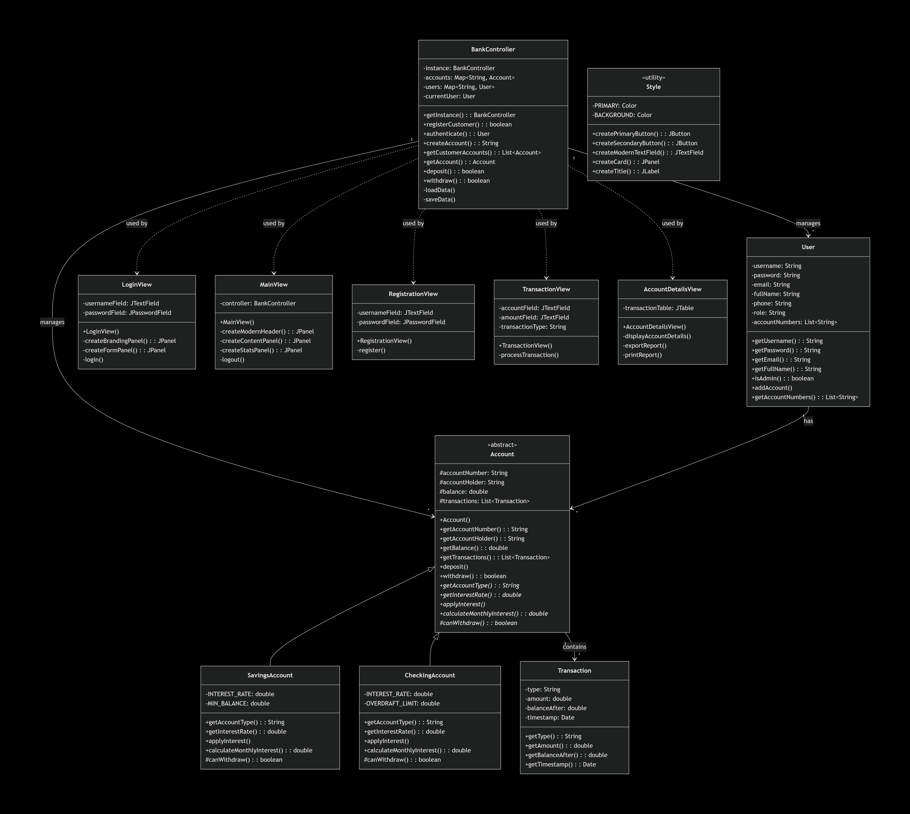
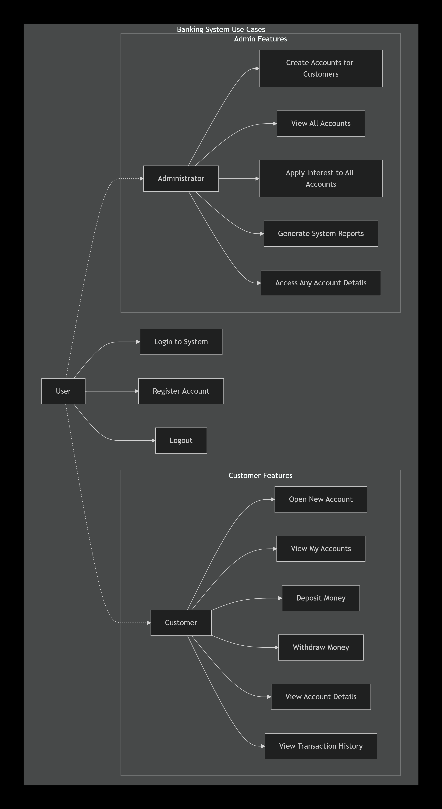
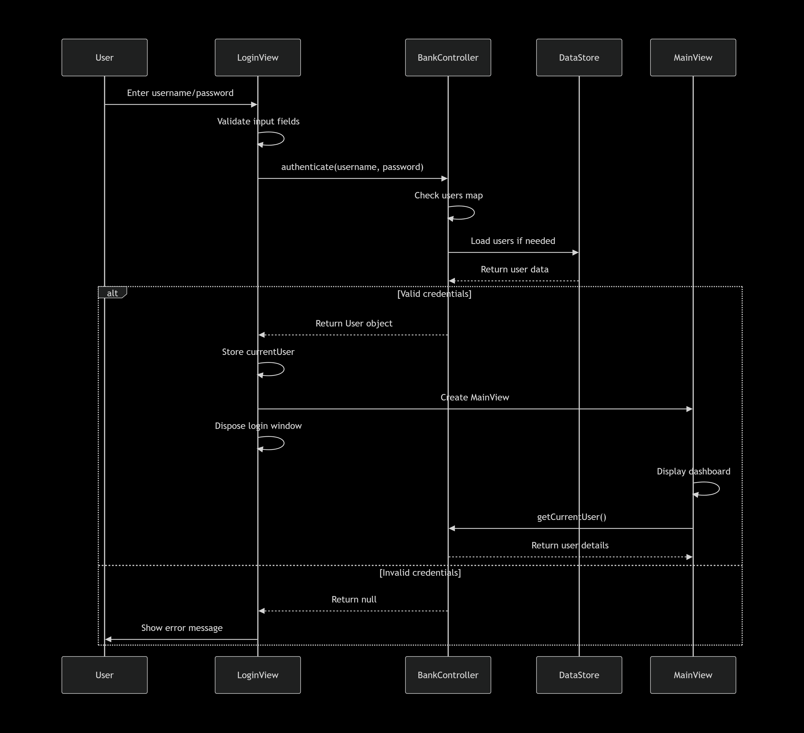
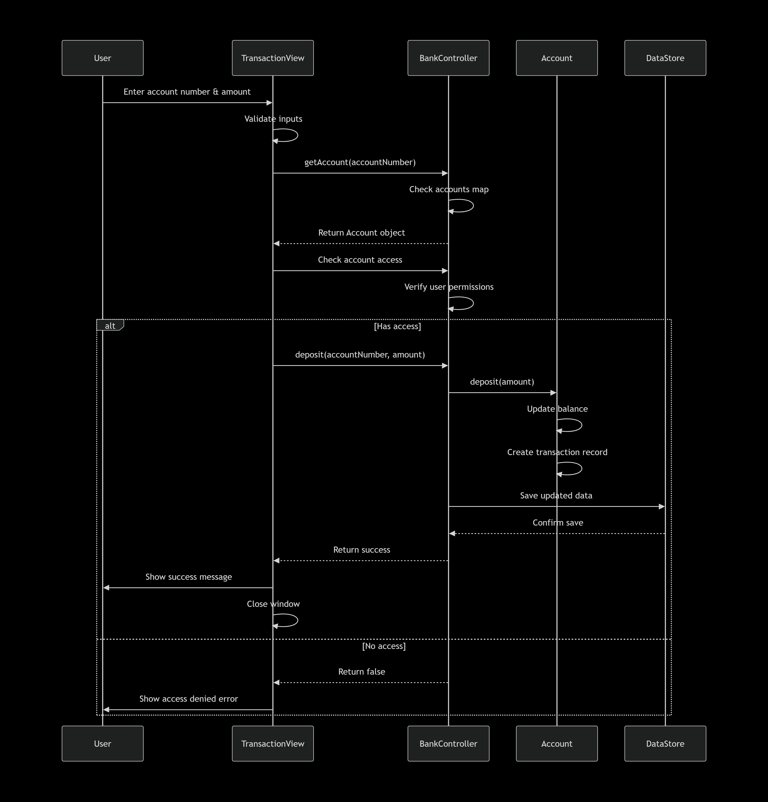
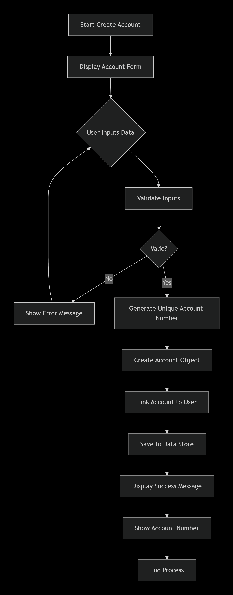
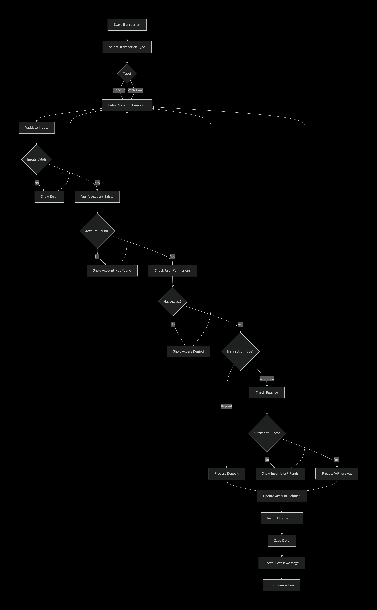

# Diagrams

This document catalogues the design diagrams that accompany SecureBank. The image files are stored in [`../diagrams/`](../diagrams/). Condensed, text-based equivalents of several diagrams are embedded in [Architecture](architecture.md).

## Contents

1. [Catalogue](#1-catalogue)
2. [Diagram Descriptions](#2-diagram-descriptions)
3. [Viewing Notes](#3-viewing-notes)

---

## 1. Catalogue

| Diagram | Type | File | Resolution |
| ------- | ---- | ---- | ---------- |
| Program Flow Chart | Flow chart | [`diagrams/ProgramFlowChart.png`](../diagrams/ProgramFlowChart.png) | 9424 × 8992 |
| Class Diagram | UML class | [`diagrams/UML/ClassDiagram.png`](../diagrams/UML/ClassDiagram.png) | 6976 × 6250 |
| Use Case Diagram | UML use case | [`diagrams/UML/UseCaseDiagram.png`](../diagrams/UML/UseCaseDiagram.png) | 2795 × 5114 |
| Login Sequence | UML sequence | [`diagrams/UML/SequenceDiagram-Login.png`](../diagrams/UML/SequenceDiagram-Login.png) | 4233 × 3864 |
| Deposit Sequence | UML sequence | [`diagrams/UML/SequenceDiagram-DepositProcess.png`](../diagrams/UML/SequenceDiagram-DepositProcess.png) | 4250 × 4439 |
| Account Creation Activity | UML activity | [`diagrams/UML/ActivityDiagram-AccountCreation.png`](../diagrams/UML/ActivityDiagram-AccountCreation.png) | 1737 × 4420 |
| Transaction Process Activity | UML activity | [`diagrams/UML/ActivityDiagram-TransactionProcess.png`](../diagrams/UML/ActivityDiagram-TransactionProcess.png) | 5275 × 8514 |

## 2. Diagram Descriptions

### 2.1 Program Flow Chart

Traces the application from launch to exit. It shows data loading (with default administrator initialization when no data file exists), the login and registration paths, the role decision after authentication, the actions available to administrators and customers, the access checks that guard account details, and the save operation that follows state-changing actions. Shutdown saves data.

**Related documentation:** [Architecture §5](architecture.md#5-persistence), [Architecture §6](architecture.md#6-key-workflows).

### 2.2 Class Diagram

Shows the static structure: `BankController` and its relationships to the views (`LoginView`, `MainView`, `RegistrationView`, `TransactionView`, `AccountDetailsView`) and the `Style` utility; `User`; the abstract `Account` and its `SavingsAccount` and `CheckingAccount` subclasses; and `Transaction`. Not every view class is depicted; see [Architecture §3.4](architecture.md#34-views-view) for the complete list.

**Related documentation:** [Architecture §4](architecture.md#4-domain-model).

### 2.3 Use Case Diagram

Groups the functionality by actor. Every user can log in, register, and log out. Administrators can create accounts for customers, view all accounts, apply interest to all accounts, generate system reports, and access any account's details. Customers can open a new account, view their accounts, deposit, withdraw, view account details, and view transaction history.

**Related documentation:** [User Guide](user-guide.md), [Business Rules §6](business-rules.md#6-access-control).

### 2.4 Sequence Diagrams

| Diagram | Purpose |
| ------- | ------- |
|  | Message flow for signing in. |
|  | Message flow for a deposit. |

**Related documentation:** [Architecture §6.1](architecture.md#61-authentication) and [§6.2](architecture.md#62-deposit-and-withdrawal).

### 2.5 Activity Diagrams

| Diagram | Purpose |
| ------- | ------- |
|  | Decision flow for creating an account. |
|  | Decision flow for processing a transaction. |

**Related documentation:** [Business Rules §3](business-rules.md#3-accounts) and [§4](business-rules.md#4-withdrawals).

## 3. Viewing Notes

- **Dark backgrounds.** The images use dark backgrounds and light lines. They are legible in any viewer but may look heavy against a light page.
- **Large images.** Several files exceed 4000 pixels in one dimension (the flow chart is over 9000). Open them in a full-size viewer and zoom, rather than relying on the scaled inline preview.
- **Canonical location.** The same set of images is also present under `src/diagrams/` and `bin/diagrams/`, the latter because the Eclipse build copies non-source resources into the output folder. The top-level `diagrams/` folder is the copy referenced by this documentation. Update all copies together, or consolidate them.
- **Keeping diagrams current.** The images depict the design at the time of drawing. If the code changes, regenerate the diagrams and review the corresponding Mermaid diagrams in [Architecture](architecture.md). The images appear to have been rendered from text-based diagram sources that are not included in the repository; retaining those sources alongside the images would make updates easier.
